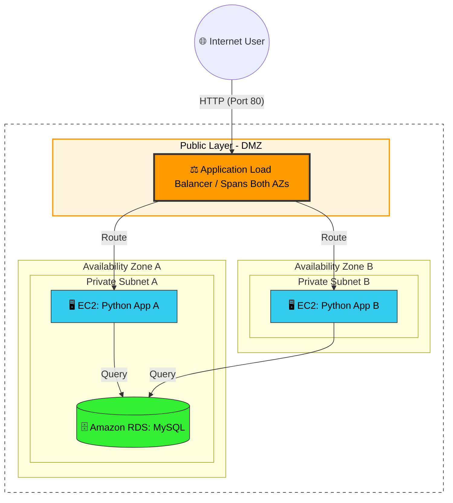

# Building a 2-Tier AWS Web Infrastructure

This project provides a comprehensive guide to manually building a highly available, secure web application infrastructure on AWS. This approach fully decouples the application layer from the database layer, utilizes an Application Load Balancer for traffic distribution, and secures backend components within isolated private networks.

## 🏗️ Architecture Overview

The following diagram illustrates how traffic flows through the network and where each component resides:



---

## 🗺️ Step 1: Configuring the Virtual Private Cloud (VPC)

*   **Create the VPC:** 
    *   Navigate to the VPC Dashboard and create a new VPC manually.
    *   Set the **IPv4 CIDR block** to `10.0.0.0/16`.
*   **Create Subnets (in 2 Availability Zones):**
    *   **AZ A:** Create 1 **Public Subnet** (e.g., `10.0.1.0/24`) and 1 **Private Subnet** (e.g., `10.0.2.0/24`).
    *   **AZ B:** Create 1 **Public Subnet** (e.g., `10.0.3.0/24`) and 1 **Private Subnet** (e.g., `10.0.4.0/24`).
*   **Internet Gateway (IGW):**
    *   Create an IGW and attach it to your VPC to allow internet access.
*   **NAT Gateway:**
    *   Allocate an Elastic IP.
    *   Create a NAT Gateway in one of the **Public Subnets**.
*   **Route Tables:**
    *   **Public Route Table:** Add a route (`0.0.0.0/0`) pointing to the **Internet Gateway**. Associate both **Public Subnets** with this table.
    *   **Private Route Table:** Add a route (`0.0.0.0/0`) pointing to the **NAT Gateway**. Associate both **Private Subnets** with this table.

## 🛡️ Step 2: Defining Security Groups

*   **ALB-SG (Application Load Balancer):**
    *   **Inbound:** Allow HTTP (Port 80) from Anywhere (`0.0.0.0/0`).
*   **App-SG (EC2 Application Servers):**
    *   **Inbound:** Allow Custom TCP (Port 80) *only* from **ALB-SG**.
    *   **Inbound:** Allow SSH (Port 22) *only* from your specific IP address.
*   **DB-SG (RDS Database):**
    *   **Inbound:** Allow MySQL/Aurora (Port 3306) *only* from **App-SG**.

## 💾 Step 3: Deploying the RDS Database

*   **DB Subnet Group:**
    *   Create a Subnet Group in RDS and explicitly select your two **Private Subnets**.
*   **Create Database:**
    *   **Engine:** MySQL.
    *   **Instance Class:** `db.t3.micro` (or similar cost-effective tier).
    *   **Public Access:** No.
    *   **Security Group:** Select the **DB-SG**.
    *   **Initial Database Name:** `guestbook_db`.
    *   Configure your Master Username and Password.
*   **Initialize Database:**
    *   Once active, securely connect to an EC2 instance in your VPC (e.g., using Cloudshell) and execute the SQL commands found in `schema.sql` against your new RDS endpoint.

## ⚙️ Step 4: Provisioning the Application Servers

*   **Launch EC2 Instances:**
    *   Launch two instances using the **Amazon Linux 2023 AMI**.
    *   Place one instance in the **Private Subnet** of AZ A, and the other in the **Private Subnet** of AZ B.
*   **IAM Role:**
    *   Attach the `LabRole` profile (if required by AWS Academy) or an equivalent role.
*   **User Data Script:**
    *   Use the Advanced Details section to supply an automated initialization script.
    *   Your script must perform the following actions:
        *   Update packages and install Python 3 and Git.
        *   Clone the project repository and install packages from `requirements.txt`.
        *   Generate a `.env` file within the project directory, populating it with your RDS connection credentials.
        *   Start the Flask application.
    *   **Example Script:** You can use the following script as a reference.
        > [!WARNING]
        > **MEMORIZATION REQUIRED**: You must thoroughly understand and memorize every single command in this script! Do not just copy and paste blindly. You are expected to know exactly how to initialize your application from scratch. Also, ensure you update the Git URL and `<DB_...>` values with your actual working credentials.

    ```bash
    #!/bin/bash
    # 1. System updates and required packages
    sudo dnf update -y
    sudo dnf install python3-pip git -y
    
    # 2. Prepare directory and fetch code
    cd /home/ec2-user
    # REPLACE the URL below with your actual Git repository URL
    git clone https://github.com/yourusername/ec2-rds-lb.git project
    cd project
    
    # 3. Install Python dependencies
    pip3 install -r requirements.txt
    
    # 4. Create the .env file with your database credentials
    cat <<EOF > .env
    DB_HOST=<your-rds-endpoint>.rds.amazonaws.com
    DB_USER=admin
    DB_PASSWORD=<your_secure_password>
    DB_NAME=guestbook_db
    EOF

    # 5. Start the Flask application on port 80
    # Sudo is required to bind to port 80
    sudo python3 app.py &
    ```

## ⚖️ Step 5: Configuring the Application Load Balancer

*   **Target Group:**
    *   **Target Type:** Instances.
    *   **Protocol:** HTTP (Port 80).
    *   **Health Check Path:** `/health`.
    *   Register your two private EC2 instances as targets.
*   **Application Load Balancer (ALB):**
    *   **Scheme:** Internet-facing.
    *   **Subnets:** Select your two **Public Subnets**.
    *   **Security Group:** Attach the **ALB-SG**.
    *   **Listeners:** Configure Port 80 to forward to your newly created Target Group.
*   **Verification:**
    *   Wait for the target group instances to become "Healthy".
    *   Copy the ALB DNS Name and paste it into your browser to view the application.